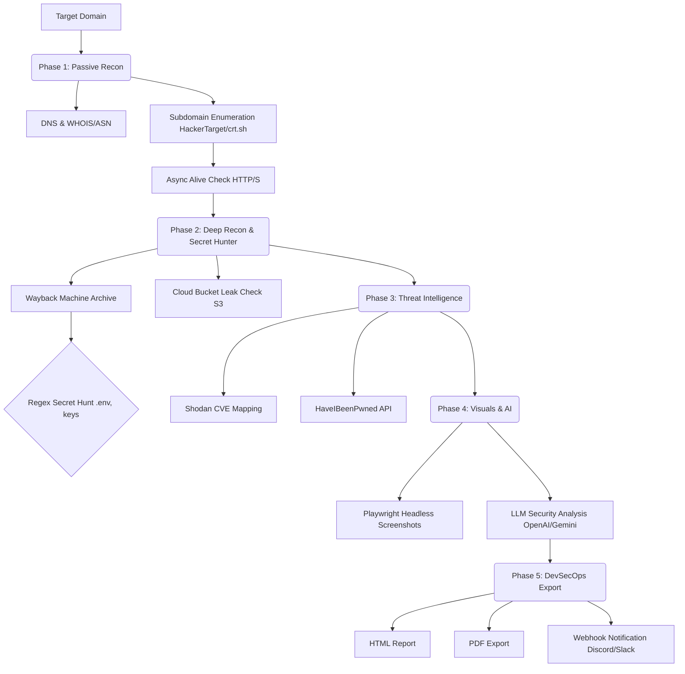

<div align="center">

# 🕵️ SenfoniScan v3.0.1
**The Ultimate AI-Powered Passive Reconnaissance CLI & DevSecOps Platform**

[](https://python.org)
[](https://playwright.dev/)
[](LICENSE)
[](#)

*A fully automated, zero-touch reconnaissance tool that maps target infrastructures, hunts for secrets, checks for data breaches, captures headless screenshots, and generates comprehensive Cyber Threat Intelligence reports using Large Language Models (LLMs).*

<p align="center">
  🇹🇷 <a href="README_tr.md">Türkçe Dokümantasyon için tıklayın</a>
</p>

</div>

---

## 📖 Table of Contents
- [Architecture & Under the Hood](#-architecture--under-the-hood)
- [Key Features](#-key-features)
- [Installation](#-installation)
- [Configuration (`config.json`)](#-configuration)
- [Usage & Examples](#-usage--examples)
- [Multi-Provider AI Engine](#-multi-provider-ai-engine)
- [DevSecOps Integration](#-devsecops-integration)
- [Legal Disclaimer](#-legal-disclaimer)

---

## 🏗 Architecture & Under the Hood

SenfoniScan operates purely passively. It never sends a direct active scanning packet (like an nmap probe) to the target, ensuring zero-noise footprint on the target's IPS/IDS.



---

## ✨ Key Features

### 🔍 Deep Passive Reconnaissance
- **Subdomain Discovery:** Queries multiple databases (`HackerTarget`, `AlienVault`, `crt.sh`) concurrently with robust fallback mechanisms.
- **Asynchronous Validation:** Validates hundreds of subdomains in seconds using Python's `asyncio` and `aiohttp`.
- **WHOIS & ASN Profiling:** Automatically extracts the registrar, creation dates, and Autonomous System Numbers (ASN) corresponding to the target's IP ranges.

### 🕵️ Secret Hunter
- **Archive Scraping:** Pulls historical URLs from the Wayback Machine.
- **Regex Pipelining:** Automatically scans extracted URLs for exposed secrets (`.env`, `wp-config.php`, `id_rsa`, `.sql`, `.bak`, `swagger.json`, etc.).

### 🧠 Hybrid AI Engine
- **LLM Threat Analysis:** Sends the raw, normalized JSON data to an AI provider (OpenAI, Gemini, Anthropic, Groq, or Local Ollama) to generate a professional Executive Summary, highlighting attack vectors, risks, and recommendations.

### 📸 Headless Screenshotter
- **Playwright Engine:** Uses a custom Playwright implementation to visit all discovered alive subdomains, ignore invalid SSL certificates, wait for network idle states, and capture beautiful visual evidence.

### ⚙️ DevSecOps Ready
- **PDF Generation:** Instantly converts the generated HTML report into an A4-sized PDF for client delivery.
- **Webhook Integration:** Sends a JSON payload to a specified Discord or Slack webhook channel the moment the scan finishes.

---

## 🛠 Installation

SenfoniScan is self-bootstrapping. Simply run the script, and it will handle the virtual environment and all dependencies automatically.

1. **Clone the repository:**
   ```bash
   git clone https://github.com/yourusername/senfoniscan.git
   cd senfoniscan
   ```

2. **Run it!:**
   ```bash
   python3 main.py --help
   ```

*(Note: On its first run, it will install required `pip` packages, download Playwright Chromium binaries, and verify `ollama`.)*

---

## ⚙️ Configuration

To avoid typing out your API keys repeatedly, SenfoniScan generates a `config.json` file on its first run.

```json
{
    "language": "en",
    "max_screenshots": 15,
    "fast_mode": false,
    "no_screenshot": false,
    "no_hibp": false,
    "no_ai": false,
    "ai_model": "",
    "api_keys": {
        "shodan": "your_shodan_key_here",
        "hibp": "your_hibp_key_here",
        "openai": "sk-proj-...",
        "gemini": "AIzaSy...",
        "claude": "sk-ant-...",
        "groq": "gsk_..."
    },
    "webhooks": {
        "discord": "https://discord.com/api/webhooks/YOUR_WEBHOOK_URL"
    }
}
```

*Note: CLI arguments (e.g., `--lang tr`, `--gemini-key XXX`) will **always override** the values present in `config.json`.*

---

## 💻 Usage & Examples

**Basic Full Scan (Defaults to Local AI - Ollama):**
```bash
./.venv/bin/python main.py -u example.com
```

**Fast Scan using Groq (Skips Wayback & Cloud Checks, finishes in seconds):**
```bash
./.venv/bin/python main.py -u example.com --fast --groq-key YOUR_KEY
```

**DevSecOps Mode (PDF Export & Webhook Notification):**
```bash
./.venv/bin/python main.py -u example.com --export-pdf --webhook "https://discord..."
```

**Turkish Language Output:**
```bash
./.venv/bin/python main.py -u example.com --lang tr
```

**Skipping Specific Phases:**
```bash
./.venv/bin/python main.py -u example.com --no-screenshot --no-hibp --no-ai
```

---

## 🤖 Multi-Provider AI Engine

SenfoniScan supports 5 different AI providers natively. It automatically selects the best available engine based on the keys provided.

| Provider | CLI Argument | Env Variable | Default Model | Performance Profile |
|----------|--------------|--------------|---------------|---------------------|
| **OpenAI** | `--openai-key` | `OPENAI_API_KEY` | `gpt-4o` | Premium, High Accuracy |
| **Gemini** | `--gemini-key` | `GEMINI_API_KEY` | `gemini-2.5-flash` | Very Fast, Generous Limits |
| **Claude** | `--claude-key` | `ANTHROPIC_API_KEY` | `claude-sonnet-4` | Exceptional Formatting |
| **Groq** | `--groq-key` | `GROQ_API_KEY` | `llama-3.3-70b` | **Free & Lightning Fast** |
| **Ollama** | *(None)* | *(None)* | `llama3` | Private, Local Execution |

You can force a specific model by using `--ai-model`:
```bash
./.venv/bin/python main.py -u example.com --openai-key XXX --ai-model o1-mini
```

---

## ⚖️ Legal Disclaimer

**For Educational and Authorized Testing Purposes Only.**
SenfoniScan is a passive reconnaissance tool. It relies entirely on public APIs, DNS records, and standard HTTP requests. However, it is the end user's absolute responsibility to comply with all applicable local, state, and federal laws. Developers assume no liability and are not responsible for any misuse or damage caused by this program.
