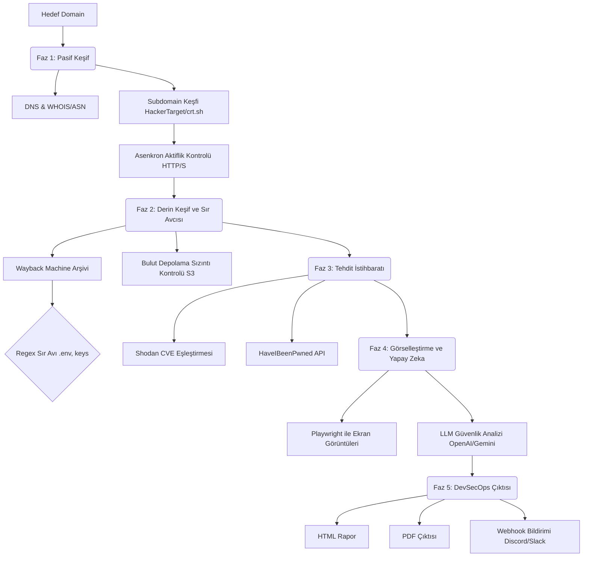

<div align="center">

# 🕵️ SenfoniScan v3.0
**Yapay Zeka Destekli En Gelişmiş Pasif Keşif CLI ve DevSecOps Platformu**

[](https://python.org)
[](https://playwright.dev/)
[](LICENSE)
[](#)

*Hedef altyapıları haritalayan, sızmış sırları (secret) avlayan, veri ihlallerini kontrol eden, otomatik ekran görüntüleri alan ve Büyük Dil Modellerini (LLM) kullanarak kapsamlı Siber Tehdit İstihbaratı raporları üreten; tam otomatik ve hedefe temas etmeyen (zero-touch) bir keşif aracı.*

<p align="center">
  🇬🇧 <a href="README.md">Click here for English Documentation</a>
</p>

</div>

---

## 📖 İçindekiler
- [Mimari ve Çalışma Mantığı](#-mimari-ve-çalışma-mantığı)
- [Temel Özellikler](#-temel-özellikler)
- [Kurulum](#-kurulum)
- [Yapılandırma (`config.json`)](#-yapılandırma)
- [Kullanım ve Örnekler](#-kullanım-ve-örnekler)
- [Çoklu Sağlayıcı Yapay Zeka Motoru](#-çoklu-sağlayıcı-yapay-zeka-motoru)
- [DevSecOps Entegrasyonu](#-devsecops-hazır)
- [Yasal Uyarı](#-yasal-uyarı)

---

## 🏗 Mimari ve Çalışma Mantığı

SenfoniScan tamamen pasif çalışır. Hedefe asla doğrudan bir aktif tarama paketi (nmap probu vb.) göndermez; bu sayede hedefin IPS/IDS sistemlerinde hiçbir iz bırakmaz.



---

## ✨ Temel Özellikler

### 🔍 Derinlemesine Pasif Keşif
- **Subdomain Keşfi:** Birden fazla veritabanını (`HackerTarget`, `AlienVault`, `crt.sh`) yedekli mekanizmalarla eşzamanlı olarak sorgular.
- **Asenkron Doğrulama:** Python'un `asyncio` ve `aiohttp` kütüphanelerini kullanarak yüzlerce subdomain'i saniyeler içinde doğrular.
- **WHOIS & ASN Profili:** Hedefin IP aralıklarına karşılık gelen kayıt şirketini, oluşturma tarihlerini ve Otonom Sistem Numaralarını (ASN) otomatik olarak çeker.

### 🕵️ Sır Avcısı (Secret Hunter)
- **Arşiv Kazıma:** Wayback Machine üzerinden geçmiş URL'leri toplar.
- **Regex Boru Hattı:** Toplanan URL'lerde açıkta kalan sırları (`.env`, `wp-config.php`, `id_rsa`, `.sql`, `.bak`, `swagger.json` vb.) otomatik olarak tarar.

### 🧠 Hibrit Yapay Zeka Motoru
- **LLM Tehdit Analizi:** Toplanan ham JSON verilerini bir yapay zeka sağlayıcısına (OpenAI, Gemini, Anthropic, Groq veya Yerel Ollama) göndererek; saldırı vektörlerini, riskleri ve önerileri vurgulayan profesyonel bir Yönetici Özeti oluşturur.

### 📸 Headless Ekran Görüntüsü Alıcı
- **Playwright Motoru:** Bulunan tüm aktif subdomain'leri ziyaret etmek, geçersiz SSL sertifikalarını yoksaymak, ağın boşta kalmasını beklemek ve yüksek kaliteli görsel kanıtlar yakalamak için özel bir Playwright uygulaması kullanır.

### ⚙️ DevSecOps Hazır
- **PDF Üretimi:** Oluşturulan HTML raporunu anında A4 boyutunda bir PDF'e dönüştürür.
- **Webhook Entegrasyonu:** Tarama bittiği anda belirtilen Discord veya Slack webhook kanalına bir JSON veri paketi gönderir.

---

## 🛠 Kurulum

### Yöntem 1: PyPI üzerinden (Önerilen)
SenfoniScan'i doğrudan `pip` (veya izole kurulum için `pipx`) ile kurabilirsiniz:

```bash
pip install senfoniscan
```

### Yöntem 2: Manuel (Kendi Kendini Yapılandıran)
SenfoniScan kendi kendini yapılandırır. Sadece betiği çalıştırın; sanal ortamı ve tüm bağımlılıkları otomatik olarak halledecektir.

1. **Depoyu klonlayın:**
   ```bash
   git clone https://github.com/12Fermata12/SenfoniScan.git
   cd SenfoniScan
   ```

2. **Çalıştırın!:**
   ```bash
   python3 main.py --help
   ```

*(Not: İlk çalıştırmada gerekli `pip` paketlerini kuracak, Playwright Chromium ikili dosyalarını indirecek ve `ollama` kurulumunu doğrulayacaktır.)*

---

## ⚙️ Yapılandırma

API anahtarlarınızı sürekli yazmaktan kaçınmak için SenfoniScan ilk çalıştırmada bir `config.json` dosyası oluşturur.

```json
{
    "language": "tr",
    "max_screenshots": 15,
    "fast_mode": false,
    "no_screenshot": false,
    "no_hibp": false,
    "no_ai": false,
    "ai_model": "",
    "api_keys": {
        "shodan": "shodan_anahtarınız",
        "hibp": "hibp_anahtarınız",
        "openai": "sk-proj-...",
        "gemini": "AIzaSy...",
        "claude": "sk-ant-...",
        "groq": "gsk_..."
    },
    "webhooks": {
        "discord": "https://discord.com/api/webhooks/WEBHOOK_URLUNUZ"
    }
}
```

*Not: Komut satırı argümanları (örneğin `--lang tr`, `--gemini-key XXX`), `config.json` içinde bulunan değerleri **daima ezer**.*

---

## 💻 Kullanım ve Örnekler

**Temel Tam Tarama (Varsayılan olarak Yerel AI - Ollama kullanır):**
```bash
senfoniscan -u example.com
```

**Groq kullanarak Hızlı Tarama (Wayback ve Bulut kontrollerini atlar, saniyeler içinde biter):**
```bash
senfoniscan -u example.com --fast --groq-key ANAHTARINIZ
```

**DevSecOps Modu (PDF Dışa Aktarma ve Webhook Bildirimi):**
```bash
senfoniscan -u example.com --export-pdf --webhook "https://discord..."
```

**Türkçe Dil Çıktısı:**
```bash
senfoniscan -u example.com --lang tr
```

**Belirli Fazları Atlamak:**
```bash
senfoniscan -u example.com --no-screenshot --no-hibp --no-ai
```

---

## 🤖 Çoklu Sağlayıcı Yapay Zeka Motoru

SenfoniScan yerel olarak 5 farklı AI sağlayıcısını destekler. Girilen anahtarlara göre mevcut olan en iyi motoru otomatik olarak seçer.

| Sağlayıcı | CLI Argümanı | Ortam Değişkeni | Varsayılan Model | Performans Profili |
|----------|--------------|--------------|---------------|---------------------|
| **OpenAI** | `--openai-key` | `OPENAI_API_KEY` | `gpt-4o` | Premium, Yüksek Doğruluk |
| **Gemini** | `--gemini-key` | `GEMINI_API_KEY` | `gemini-2.5-flash` | Çok Hızlı, Cömert Limitler |
| **Claude** | `--claude-key` | `ANTHROPIC_API_KEY` | `claude-sonnet-4` | Olağanüstü Formatlama |
| **Groq** | `--groq-key` | `GROQ_API_KEY` | `llama-3.3-70b` | **Ücretsiz ve Işık Hızında** |
| **Ollama** | *(Yok)* | *(Yok)* | `llama3` | Gizli, Yerel Çalıştırma |

Spesifik bir modeli `--ai-model` kullanarak zorlayabilirsiniz:
```bash
./.venv/bin/python main.py -u example.com --openai-key XXX --ai-model o1-mini
```

---

## ⚖️ Yasal Uyarı

**Sadece Eğitim ve Yetkili Test Amaçları İçindir.**
SenfoniScan pasif bir keşif aracıdır. Tamamen halka açık API'lere, DNS kayıtlarına ve standart HTTP isteklerine dayanır. Bununla birlikte, yürürlükteki tüm yerel, eyalet ve federal yasalara uymak tamamen son kullanıcının sorumluluğundadır. Geliştiriciler hiçbir sorumluluk kabul etmez ve bu programın neden olduğu herhangi bir kötüye kullanım veya hasardan sorumlu değildir.
