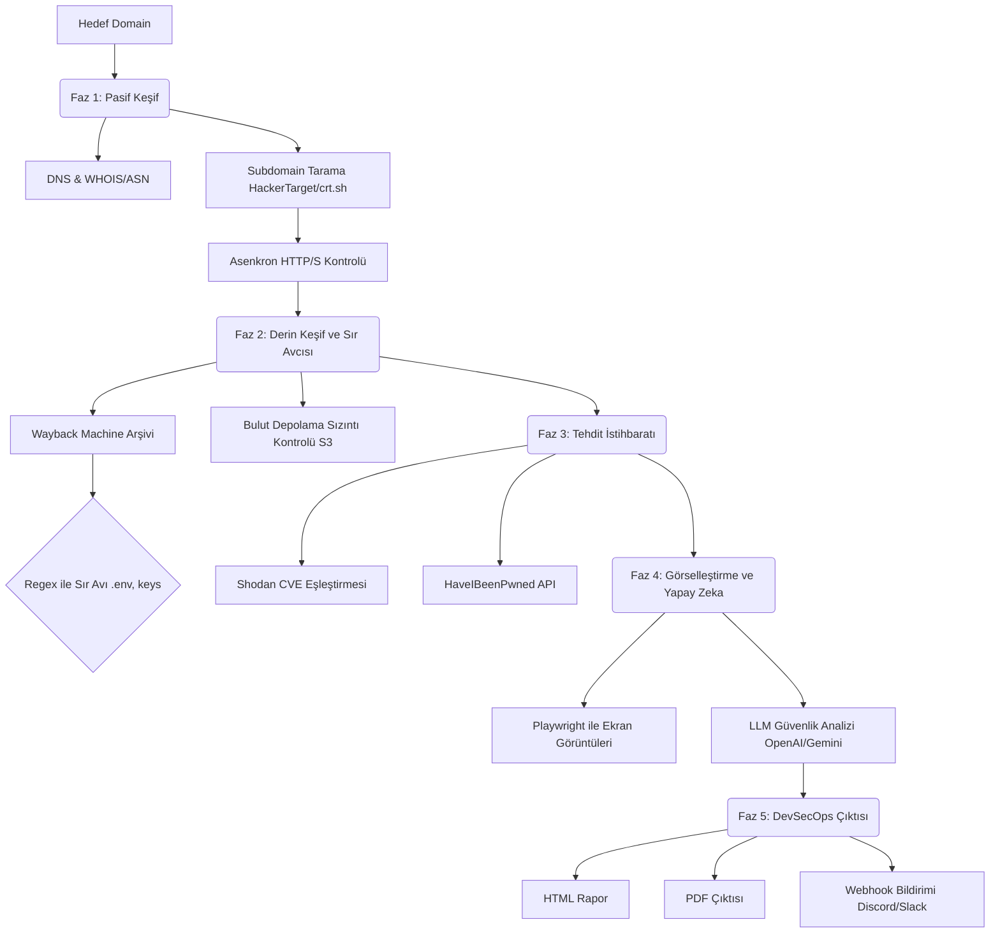

<div align="center">

# 🕵️ SenfoniScan v3.0
**Yapay Zeka Destekli Pasif Keşif ve DevSecOps Platformu**

[](https://python.org)
[](https://playwright.dev/)
[](LICENSE)
[](#)

*Hedef sunucuya doğrudan hiçbir aktif paket göndermeden; altyapıları haritalayan, sızmış sırları (secret) avlayan, veri ihlallerini kontrol eden, otomatik ekran görüntüleri alan ve LLM'leri kullanarak kapsamlı Siber Tehdit İstihbaratı raporları üreten tam otomatik bir keşif aracı.*

<p align="center">
  🇬🇧 <a href="README.md">Click here for English Documentation</a>
</p>

</div>

---

## 📖 İçindekiler
- [Mimari ve Çalışma Mantığı](#-mimari-ve-çalışma-mantığı)
- [Temel Özellikler](#-temel-özellikler)
- [Kurulum](#-kurulum)
- [Yapılandırma (`config.json`)](#-yapılandırma)
- [Kullanım ve Örnekler](#-kullanım-ve-örnekler)
- [Çoklu Yapay Zeka Desteği](#-çoklu-yapay-zeka-desteği)
- [Yasal Uyarı](#-yasal-uyarı)

---

## 🏗 Mimari ve Çalışma Mantığı

SenfoniScan tamamen pasif çalışır. Hedefe asla doğrudan bir tarama paketi (örneğin nmap probu) göndermez, bu sayede hedefin IPS/IDS sistemlerinde (güvenlik duvarı) hiçbir iz bırakmaz.



---

## ✨ Temel Özellikler

### 🔍 Derinlemesine Pasif Keşif
- **Subdomain Keşfi:** Çeşitli veritabanlarını (`HackerTarget`, `AlienVault`, `crt.sh`) eşzamanlı olarak sorgular.
- **Asenkron Doğrulama:** Yüzlerce subdomaini saniyeler içinde Python'un `asyncio` altyapısıyla doğrular.
- **WHOIS & ASN Profili:** Hedefin IP aralıklarına karşılık gelen ASN (Otonom Sistem Numarası), kayıt şirketi ve kuruluş tarihlerini otomatik olarak çeker.

### 🕵️ Sır Avcısı (Secret Hunter)
- **Arşiv Kazıma:** Wayback Machine üzerinden hedefin geçmiş URL'lerini çeker.
- **Regex Boru Hattı:** Çekilen URL'lerde sızdırılmış olabilecek hassas dosyaları (`.env`, `wp-config.php`, `id_rsa`, `.sql`, `.bak` vb.) otomatik arar.

### 🧠 Hibrit Yapay Zeka Motoru
- **LLM Tehdit Analizi:** Toplanan tüm karmaşık JSON verisini bir yapay zeka sağlayıcısına (OpenAI, Gemini, Anthropic, Groq veya Yerel Ollama) göndererek, saldırı vektörlerini, riskleri ve çözüm önerilerini içeren profesyonel bir Yönetici Özeti (Executive Summary) oluşturur.

### 📸 Otomatik Ekran Görüntüsü
- **Playwright Motoru:** Bulunan tüm aktif subdomainleri tek tek ziyaret eder, geçersiz SSL sertifikalarını göz ardı eder ve rapor için sitelerin yüksek çözünürlüklü ekran görüntülerini alır.

### ⚙️ DevSecOps Hazır
- **PDF Üretimi:** Oluşturulan HTML raporunu, müşteriye sunulmaya hazır şık bir A4 PDF formatına saniyeler içinde dönüştürür.
- **Webhook Entegrasyonu:** Tarama biter bitmez Discord veya Slack kanalınıza anında özet bilgi içeren JSON bildirimleri gönderir.

---

## 🛠 Kurulum

SenfoniScan kendi kendini kuracak şekilde tasarlanmıştır. Sanal ortamı ve gerekli kütüphaneleri manuel olarak yapılandırmanıza gerek yoktur.

1. **Repoyu klonlayın:**
   ```bash
   git clone https://github.com/yourusername/senfoniscan.git
   cd senfoniscan
   ```

2. **Çalıştırın!:**
   ```bash
   python3 main.py --help
   ```

*(Not: İlk çalıştırmada gerekli `pip` paketlerini kuracak, Playwright Chromium tarayıcısını indirecek ve sistemdeki `ollama` durumunu kontrol edecektir.)*

---

## ⚙️ Yapılandırma

API anahtarlarınızı sürekli terminale yazmamak için SenfoniScan ilk çalıştırmada otomatik olarak bir `config.json` dosyası oluşturur.

```json
{
    "language": "en",
    "max_screenshots": 15,
    "fast_mode": false,
    "no_screenshot": false,
    "no_hibp": false,
    "no_ai": false,
    "ai_model": "",
    "api_keys": {
        "shodan": "sizin_shodan_anahtarınız",
        "hibp": "sizin_hibp_anahtarınız",
        "openai": "sk-proj-...",
        "gemini": "AIzaSy...",
        "claude": "sk-ant-...",
        "groq": "gsk_..."
    },
    "webhooks": {
        "discord": "https://discord.com/api/webhooks/WEBHOOK_ADRESINIZ"
    }
}
```

*Not: Komut satırından girilen parametreler (örneğin `--lang tr`, `--gemini-key XXX`), her zaman `config.json` içindeki değerleri **ezer**.*

---

## 💻 Kullanım ve Örnekler

**Varsayılan Tam Tarama (Yerel AI - Ollama Kullanarak):**
```bash
./.venv/bin/python main.py -u example.com
```

**Groq Kullanarak Hızlı Tarama (Arşiv ve Bulut kontrollerini atlar, saniyeler sürer):**
```bash
./.venv/bin/python main.py -u example.com --fast --groq-key ANAHTAR_BURAYA
```

**DevSecOps Modu (PDF Çıktısı ve Webhook Bildirimi):**
```bash
./.venv/bin/python main.py -u example.com --export-pdf --webhook "https://discord..."
```

**Türkçe Dil Çıktısı Almak İçin:**
```bash
./.venv/bin/python main.py -u example.com --lang tr
```

**Belirli Fazları Atlamak:**
```bash
./.venv/bin/python main.py -u example.com --no-screenshot --no-hibp --no-ai
```

---

## 🤖 Çoklu Yapay Zeka Desteği

SenfoniScan 5 farklı AI sağlayıcısını yerel olarak destekler. Sağlanan API anahtarlarına göre otomatik olarak en iyi olanı seçer.

| Sağlayıcı | Komut Satırı | Çevresel Değişken | Varsayılan Model | Performans & Maliyet |
|----------|--------------|--------------|---------------|---------------------|
| **OpenAI** | `--openai-key` | `OPENAI_API_KEY` | `gpt-4o` | Premium, Yüksek Doğruluk |
| **Gemini** | `--gemini-key` | `GEMINI_API_KEY` | `gemini-2.5-flash` | Çok Hızlı, Ücretsiz Limiti Yüksek |
| **Claude** | `--claude-key` | `ANTHROPIC_API_KEY` | `claude-sonnet-4` | Mükemmel Raporlama Formatı |
| **Groq** | `--groq-key` | `GROQ_API_KEY` | `llama-3.3-70b` | **Ücretsiz ve İnanılmaz Hızlı** |
| **Ollama** | *(Yok)* | *(Yok)* | `llama3` | Özel, Yerel Çalıştırma (GPU Gerekir) |

Spesifik bir modeli zorlamak isterseniz `--ai-model` kullanabilirsiniz:
```bash
./.venv/bin/python main.py -u example.com --openai-key XXX --ai-model o1-mini
```

---

## ⚖️ Yasal Uyarı

**Sadece Eğitim ve Yetkili Test Amaçları İçindir.**
SenfoniScan pasif bir bilgi toplama aracıdır. Tamamen halka açık (public) API'lere, DNS kayıtlarına ve standart HTTP isteklerine dayanır. Ancak, yürürlükteki yerel ve ulusal yasalara uymak tamamen son kullanıcının sorumluluğundadır. Geliştiriciler hiçbir sorumluluk kabul etmez ve bu programın kötüye kullanımından doğacak zararlardan sorumlu tutulamazlar.
